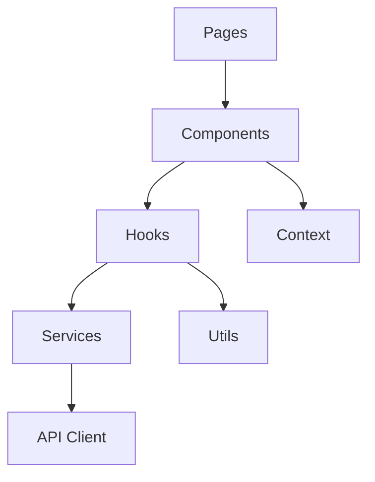
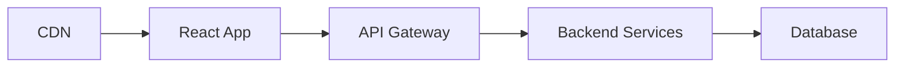

# Architecture Documentation

## System Overview

CPR.Chat is built using a modern React architecture with TypeScript, emphasizing type safety, maintainability, and scalability.

## Core Architecture Principles

### 1. Clean Architecture

The application follows clean architecture principles with clear separation of concerns:

```
Presentation Layer (UI)
    │
    ▼
Application Layer (Business Logic)
    │
    ▼
Domain Layer (Core Business Rules)
    │
    ▼
Infrastructure Layer (External Services)
```

### 2. Key Components

#### Frontend Architecture



#### Error Handling

- Centralized error handling through custom error classes
- Consistent error reporting and logging
- Error boundary implementation for React components

#### State Management

- React Context for global state
- Custom hooks for shared logic
- Local component state for UI-specific data

### 3. Security Measures

- Input validation using Zod schemas
- JWT-based authentication
- Environment-based configuration
- Secure secret management

### 4. Testing Strategy

- Unit tests for business logic
- Integration tests for API interactions
- E2E tests for critical paths
- Performance testing with k6

## Design Patterns

### 1. Component Patterns

- Compound Components
- Render Props
- Custom Hooks
- Higher-Order Components

### 2. Service Patterns

- Repository Pattern for data access
- Adapter Pattern for external services
- Observer Pattern for event handling
- Factory Pattern for object creation

## Performance Considerations

1. **Code Splitting**
   - Route-based splitting
   - Component lazy loading
   - Dynamic imports

2. **Caching Strategy**
   - API response caching
   - React Query for server state
   - Local storage for persistence

3. **Optimization Techniques**
   - Memoization
   - Virtual scrolling
   - Image optimization
   - Bundle size optimization

## Deployment Architecture



## Future Considerations

1. **Scalability**
   - Microservices architecture
   - Container orchestration
   - Serverless functions

2. **Monitoring**
   - Error tracking
   - Performance monitoring
   - User analytics

3. **Feature Roadmap**
   - Real-time collaboration
   - File sharing
   - Video chat integration
